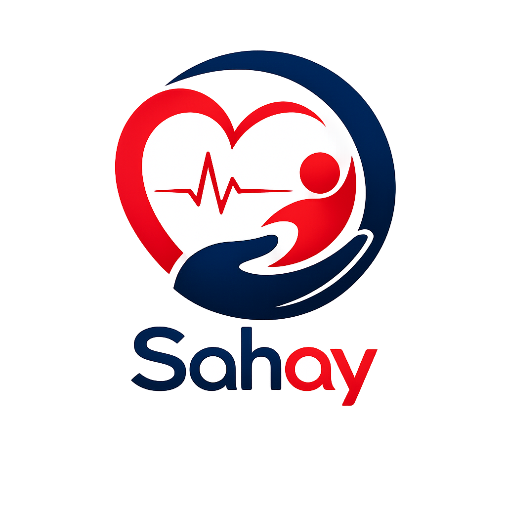

<div align="center">
  

  # 🚨 Sahay (સહાય)
  ### National Emergency Ecosystem • PS-10 Golden Hour Response

  [](https://flutter.dev/)
  [](https://www.php.net/)
  [](https://devpost.com/)
  [](#)

  **Empowering Good Samaritans. Connecting Responders. Saving Lives.**
</div>

---

<div align="center">
  
</div>

## 🌟 The Vision

**Every second counts. You can be the reason someone lives.**
**Sahay (સહાય)** is an advanced, fully integrated **National Emergency Ecosystem** engineered to revolutionize the *Golden Hour* response during road traffic accidents and critical incidents. By seamlessly bridging the communication gap between bystanders, emergency responders, hospitals, and law enforcement, Sahay aims to drastically reduce highway response times to **under 5 minutes** and save over **50,000 lives annually**.

---

## 🚀 The Ecosystem Architecture

Sahay is not just an app; it's a comprehensive suite composed of **3 Flutter Applications** and **2 PHP Web Portals** working in perfect unison.

### 📱 1. Citizen & Driver App (Flutter — 24 Screens)
Empowering everyday citizens to become heroes without the fear of legal harassment.
*   🚨 **Emergency SOS:** One-tap alert to 108 and nearest responders.
*   🧠 **AI Accident Scan:** Instantly analyzes crash scenes using AI to assess severity (Confidence Score > 90%) and pre-alert trauma centers with probable injury lists (e.g., arterial bleeding, head trauma).
*   🛡️ **Good Samaritan Protection Pass:** Issues a digital immunity passport under **MV Act Sec 134A**, guaranteeing protection from police harassment and mandatory court appearances.
*   🩺 **AI Guided First Aid:** Real-time CPR rhythm metronome (100 BPM) and interactive first-aid training modules.
*   📍 **Live Tracking:** Track the approaching ambulance with real-time ETAs.

### 🚑 2. Ambulance Response App (Flutter — 21 Screens)
Supercharging paramedics with critical data before they even reach the hospital.
*   📡 **Mission Dispatch:** Real-time assignment with exact GPS coordinates and severity tagging.
*   ❤️ **Patient Vitals Sync:** Log and instantly transmit on-scene vitals (BP, Pulse, SpO2, Blood Group).
*   🏥 **Hospital Pre-Alert:** One-click pre-alert to the selected destination hospital to prepare the ER.
*   ✅ **Digital Checklist:** Real-time tracking of Oxygen, AED, and First Aid inventory.

### 🚓 3. Police Control App (Flutter — 24 Screens)
Streamlining law enforcement and ensuring the safety of Good Samaritans.
*   🔍 **Field Immunity Scanner:** Instantly scan a bystander's Sahay QR to verify their Good Samaritan status (DO NOT DETAIN).
*   📸 **Evidence Capture:** On-scene photo and telematics capture.
*   🔗 **eDAR Auto-Sync:** Direct integration with the MoRTH eDAR portal for stolen vehicles and crash databases.

### 🏥 4. Hospital ER Casualty Portal (PHP Web)
Transforming ER preparedness with zero-latency communication.
*   🔔 **Real-Time Web Push Alerts:** WebSocket-powered alerts with loud chimes for incoming critical trauma patients.
*   ⏱️ **Pre-Arrival Triage:** ER doctors receive injury details and ETAs, allowing them to prep 128-Slice CTs and Blood Banks *before* arrival.
*   🎟️ **Green-Channel Admission:** Scan the bystander's Sahay Passport to instantly admit the patient and grant the bystander legal immunity on record.

### 🏢 5. Government Admin Console (PHP Web)
The master overview for national scaling and analytics.
*   📊 **eDAR Analytics:** Deep dive into crash statistics and response metrics.
*   🗺️ **Blackspot GIS Mapping:** Identify and analyze accident-prone zones (e.g., NH-8E & SH-25).
*   📈 **National Scale-Up:** Real-time tracking of lives saved and response time optimization across the NHAI network.

---

## 🛠️ Tech Stack & Implementation

<div align="center">
  <table>
    <tr>
      <td align="center"><b>Mobile Development</b></td>
      <td align="center"><b>Backend & Web</b></td>
      <td align="center"><b>Real-Time & API</b></td>
      <td align="center"><b>Design & UI</b></td>
    </tr>
    <tr>
      <td align="center"></td>
      <td align="center"></td>
      <td align="center"></td>
      <td align="center"></td>
    </tr>
  </table>
</div>

---

## 🏆 Hackathon Impact

*   **Team:** InnovNation
*   **Chapter:** Bhavnagar
*   **Target Impact:** Over 50,000 lives saved annually.
*   **Metric Improvement:** Bringing highway response times down from 20+ mins to **< 5 Mins**.

---

## 💡 How to Run the Project Locally

1. **Clone the repository:**
   ```bash
   git clone https://github.com/RajBarot3826/Sahay.git
   ```
2. **Web Simulator:** 
   Open `index.html` in your browser to view the interactive 3-App + 2-Portal simulator.
3. **Flutter Apps:** 
   Navigate to the respective directories (`flutter_app` / `flutter_apps`) and run `flutter pub get` followed by `flutter run`.
4. **PHP Backends:**
   Host the `php_web_portals` directory using XAMPP/WAMP or a local PHP server (`php -S localhost:8000`).

---
<div align="center">
  <i>Designed with ❤️ by Team InnovNation to save lives.</i>
</div>
